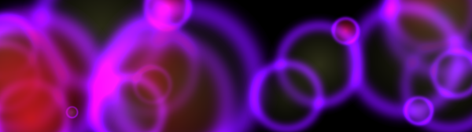
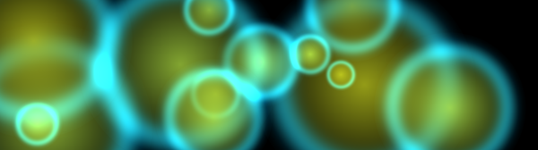
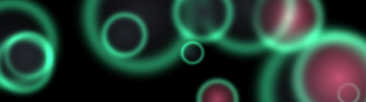
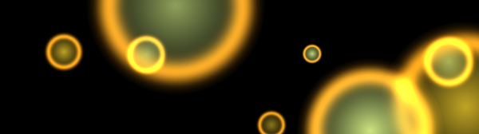

# OLED Wallpaper Magic

> **Beautiful abstract wallpapers featuring soft, glowing circles against pure black.**

[**Download Latest Release**](https://github.com/nexxyz/OledWallpaperMagic/releases/latest)

Generate hundreds of variations, review them in a desktop window, and keep only the best.

Pair it with **Windows Slideshow** (`Settings → Personalize → Background → Slideshow`) to cycle through your kept wallpapers automatically — great for keeping your OLED screen fresh and healthy.

### Examples

| | | |
|:---:|:---:|:---:|
|  |  |  |
|  |  |  |

---

## Getting Started

### Option 1: Download the EXE (Windows)

1. Download the latest release from [GitHub Releases](https://github.com/nexxyz/OledWallpaperMagic/releases/latest)
2. Extract the ZIP file
3. Double-click `OledWallpaperMagic.exe` to launch

### Option 2: Run from Source (All Platforms)

```bash
# Windows PowerShell
python -m venv .venv
.venv\Scripts\Activate.ps1
pip install -e .

# macOS/Linux
python -m venv .venv
source .venv/bin/activate
pip install -e .
```

Requires Python 3.11+.

### Launch the GUI

**EXE:** Double-click `OledWallpaperMagic.exe`

**Source:** Run `owm gui`

The GUI opens with `awesome_bubbles` as the default style. Use the **Randomize** buttons with **lock toggles** to explore controlled variation — lock what you like, randomize what you don't. When you're happy with a look, set your batch count and hit **Generate**.

### General Workflow

1. Set your style in the GUI (or load a preset)
2. Use **Randomize** + lock toggles to explore controlled variation
3. Set batch options in **Batch Creation**
4. Generate and review in the built-in review window
5. Finalize to export kept wallpapers

---

## Presets

Built-in presets ship with OLED Wallpaper Magic:

| Preset | Description |
|--------|-------------|
| `minimal` | Sparse, calm — 3–6 large circles, soft falloff |
| `dense` | Many overlapping circles — 15–30, sharper edges |
| `ultrawide` | Optimized for 3440×1440, medium density with glow |
| `vivid` | High saturation random colors, medium circles |
| `subtle` | Low saturation pastels, soft glow |
| `awesome_bubbles` | Deep contrast bubbles with strong violet glow |
| `cool_violet` | Cool violet ambience with broader circle spread |

---

## CLI Reference

For advanced usage, scripting, and headless generation, see [CLI.md](CLI.md).

---

## Design

See `DESIGN.md` for the full functional design document including algorithm details, UI layout, data models, and implementation plan.
