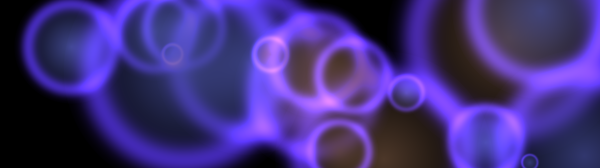
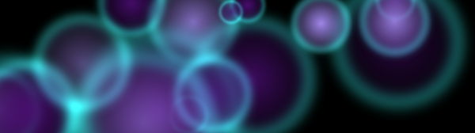

# oledwall

> **⚠️ Under Construction — v0.1.0 pre-release**
>
> This tool is functional but still maturing. API, CLI, and config formats may change.

> OLED-friendly fuzzy circle wallpaper generator with CLI and a desktop review UI.

Generate beautiful abstract wallpapers featuring soft, glowing circles against pure black (or another color of your choice). Bulk-generate hundreds of variations, review them in a desktop window, and keep only the best.

The GUI starts with the `awesome_bubbles` style as its default look.

### Examples

| | | |
|:---:|:---:|:---:|
|  |  |  |
|  |  |  |

---

## Setup (Recommended)

Create and use a local virtual environment so PySide6 and tooling resolve cleanly:

```bash
# Windows PowerShell
python -m venv .venv
.venv\Scripts\Activate.ps1
pip install -e .

# macOS/Linux
python -m venv .venv
source .venv/bin/activate
pip install -e .
```

You can still install globally if you prefer:

## Install

```bash
pip install -e .
```

Requires Python 3.11+.

**Dependencies:** Pillow, NumPy, Typer, Rich, Pydantic, PySide6.

---

## Quick Start

```bash
# Generate 50 wallpapers at 2560x1440, then review them
oledwall run --count 50

# Or generate first, review later
oledwall gen --count 100 --resolution 3440x1440
oledwall review ./wallpapers/_batch/session_20260405_153012
```

Windows launchers:

- `run_gui.bat` - starts GUI via `pythonw` (console-free after launch)
- `run_gui.vbs` - true no-console launcher for double-click use

## General Workflow

1. Set your style in `oledwall gui` (or load a preset)
2. Use `Randomize` + locks to explore controlled variation
3. Set batch options in **Batch Creation**
4. Generate and review in the built-in review window
5. Finalize to export kept wallpapers to your output folder

---

## Commands

### `oledwall gen` — Generate a session

```bash
oledwall gen [OPTIONS]
```

**Generation options:**

| Flag | Default | Description |
|------|---------|-------------|
| `--count`, `-n` | `50` | Number of wallpapers to generate |
| `--resolution`, `-r` | `2560x1440` | Resolution as `WIDTHxHEIGHT` |
| `--min-circles` | `4` | Minimum circle count per image |
| `--max-circles` | `20` | Maximum circle count per image |
| `--min-radius` | `60` | Minimum circle radius in pixels |
| `--max-radius` | `400` | Maximum circle radius in pixels |
| `--curve` | `gaussian` | Falloff curve: `linear`, `ease`, `exp`, `gaussian`, `flat` |
| `--curve-param` | `2.0` | Curve sharpness/intensity (> 0) |
| `--glow-strength` | `0.3` | Glow edge intensity (0 = off) |
| `--glow-mu` | `0.88` | Glow ring center (fraction of radius) |
| `--glow-sigma` | `0.07` | Glow ring width |
| `--background` | `#000000` | Background color (hex or `rgb(r,g,b)`) |
| `--primary` | `random` | Primary circle color or `random` |
| `--secondary` | `random` | Secondary circle color or `random` |
| `--glow-color` | `#FFF3C8` | Glow edge color |
| `--seed` | _(none)_ | Random seed for reproducibility |
| `--workers`, `-w` | `1` | Parallel workers (0 = auto) |
| `--preset` | _(none)_ | Load a named preset as base config |
| `--save-dir` | `./wallpapers/kept` | Final output folder |
| `--temp-dir` | `./wallpapers/_batch` | Session staging folder |

**Examples:**

```bash
# Default settings, 80 wallpapers at 1440p
oledwall gen --count 80

# Reproducible batch
oledwall gen --count 100 --seed 42

# Dense, sharp circles
oledwall gen --count 50 --min-circles 15 --max-circles 30 --curve ease --curve-param 3.0

# Large, soft, sparse circles on black
oledwall gen --count 30 --min-circles 3 --max-circles 6 --min-radius 150 --max-radius 600 --curve gaussian --curve-param 1.5

# Using a preset
oledwall gen --preset ultrawide --count 120 --resolution 3440x1440

# Custom colors
oledwall gen --count 30 --primary "#FF3366" --secondary "#33CCFF" --glow-color "#FFFFFF"
```

---

### `oledwall run` — Generate + review immediately

```bash
oledwall run [OPTIONS]
```

Same options as `gen`. After generation finishes, immediately opens the windowed review UI.

---

### `oledwall review` — Review a session

```bash
oledwall review SESSION_PATH [OPTIONS]
```

| Flag | Description |
|------|-------------|
| `SESSION_PATH` | Path to the session directory |
| `--start`, `-s` | Start index (default: 0) |

---

### `oledwall presets` — Manage presets

```bash
# List all available presets
oledwall presets list

# Show a preset's full configuration
oledwall presets show ultrawide

# Delete a user preset (built-in presets cannot be deleted)
oledwall presets delete my-preset
```

---

## Review UI Controls

The review UI runs in a regular desktop window (Qt / PySide6).

| Key | Action |
|-----|--------|
| `→` or `Space` | Next image |
| `←` or `Backspace` | Previous image |
| `K` or `A` | **Keep** — marks for export |
| `D` or `X` | **Discard** |
| `U` | Unmark (reset to undecided) |
| `G` | Jump to first undecided image |
| `Home` / `End` | First / last image |
| `R` | Random jump |
| `Enter` | **Finalize** — export kept images |
| `Esc` or `Q` | Quit |

Click on a thumbnail at the bottom to jump directly to that image.

Finalization prompts for confirmation, then copies all kept images to your `--save-dir` with timestamped filenames.

---

## Presets

Built-in presets ship with oledwall:

| Preset | Description |
|--------|-------------|
| `minimal` | Sparse, calm — 3–6 large circles, soft falloff |
| `dense` | Many overlapping circles — 15–30, sharper edges |
| `ultrawide` | Optimized for 3440×1440, medium density with glow |
| `vivid` | High saturation random colors, medium circles |
| `subtle` | Low saturation pastels, soft glow |
| `awesome_bubbles` | Deep contrast bubbles with strong violet glow |
| `cool_violet` | Cool violet ambience with broader circle spread |

---

## Alpha Curves

The `--curve` flag controls how the circle fades from center to edge:

| Curve | Formula | Feel |
|-------|---------|------|
| `linear` | `a = 1 - t` | Soft linear falloff |
| `ease` | `a = (1 - t)^k` | Power curve — higher `k` = sharper |
| `exp` | `a = exp(-k·t)` | Exponential decay |
| `gaussian` | `a = exp(-t²·k)` | Smooth bell-shaped falloff (default) |

---

## Reproducibility

Pass `--seed` to get the same batch on repeated runs:

```bash
oledwall gen --count 50 --seed 12345
# ... generate again with same seed ...
oledwall gen --count 50 --seed 12345  # identical output
```

The seed is stored in the session metadata alongside per-image seeds.

---

## Session Structure

```
wallpapers/
├── _batch/
│   └── session_20260405_153012/
│       ├── generated/
│       │   ├── img_0001.png
│       │   └── img_0002.png
│       ├── metadata.json        # full config snapshot
│       └── review_state.json   # keep/discard state
└── kept/                       # final exports
    ├── oled_20260405_0001.png
    └── oled_20260405_0007.png
```

---

## Design

See `DESIGN.md` for the full functional design document including algorithm details, UI layout, data models, and implementation plan.
